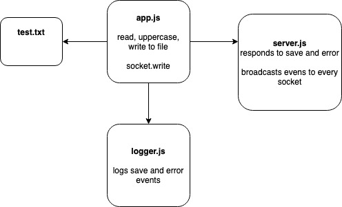

#  LAB

## Lab-18-socket.io

### Author: Bonnie Wang

### Links and Resources

- [submission PR](https://github.com/401-advanced-javascript-bw/lab-18-socket.io/pull/1)
- [back-end](https://github.com/401-advanced-javascript-bw/lab-18-socket.io/tree/submission)

#### Documentation

- [api docs](http://xyz.com) (API servers)
- [jsdoc](http://xyz.com) (Server assignments)

#### `app.js -> reads and writes file to uppercase and emits socket`

#### `logger.js -> logs save and error events`

#### `constants.js -> SERVER_URL`

#### `events.js -> socket events`

### Setup

#### `.env` requirements

- `PORT 3000`

#### Running the app

- `npm i`
- `npm start`
- `node server.js`
- `node logger.js`
- `node ./app.js ./files/test.txt`

#### UML

